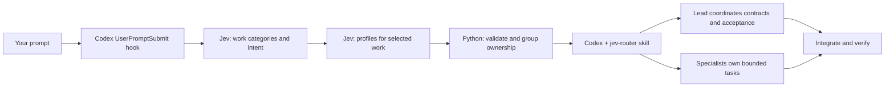

# Jev Codex Router

**Give every coding request a route. Give every subagent a clear job.**

Jev Codex Router classifies your prompts with [Jev by TypeSafe](https://docs.typesafe.ai/sdk/python/), selects execution profiles, and helps Codex split substantial independent work between scoped subagents. Submit a normal prompt: the routing hook runs before Codex starts handling it.

[Русский](README.ru.md) · [Quick start](#quick-start) · [How it works](#how-it-works) · [Configuration](docs/CONFIGURATION.md) · [Contributing](CONTRIBUTING.md)


Independent community project. Not affiliated with OpenAI or TypeSafe. **Early release:** local routing and installation are tested; live Jev accuracy and end-to-end Codex delegation still need validation. See [test evidence](docs/TESTING.md).

## Why use it?

A small style change and a feature spanning a UI and an API need different execution strategies. Jev Router adds an editable decision layer before the work begins:

- **Automatic entry point.** A `UserPromptSubmit` hook routes normal prompts without requiring a skill name in every message.
- **Task-aware profiles.** Fourteen work categories and seven model/effort presets, with criteria you can read and change.
- **A coordinated team.** Codex leads the work, assigns bounded tasks to specialists, tracks dependencies and accepts their results. Related edits share an owner; five candidate labels do not mean five agents.
- **Persistent setup.** One installer manages the runtime, skill, agents and hook. Save a key once or supply it through the environment.
- **Visible uncertainty.** Ambiguous requests retain their uncertainty; provider failures produce a warning and let Codex continue.
- **Optional follow-up context.** A small session task summary helps interpret “fix this” while preserving constraints, completed work and ownership. Dispatch records distinguish recommendations from reported tool outcomes.

The goal is better allocation of work. This release makes **no measured cost, speed or accuracy claim**.

## Quick start

**Looking for the classifier prompts?** Read [jev_router/prompts/](jev_router/prompts/README.md):
[categories](jev_router/prompts/domains.toml), [profiles](jev_router/prompts/profiles.toml),
and [shared rules](jev_router/prompts/routing.toml). Run `python run.py prompts --category backend_api`
to inspect the actual question without credentials or API calls.

You need Python **3.11+**, internet access, a TypeSafe API key, and a local Codex client with [hooks](https://learn.chatgpt.com/docs/hooks) and [custom subagents](https://learn.chatgpt.com/docs/agent-configuration/subagents). Model availability depends on your account.

Download this repository and open its directory. Run **one installation command**:

```powershell
# Windows
py -3 install.py
```

```sh
# macOS / Linux
python3 install.py
```

The installer creates a private Python environment, installs the supported TypeSafe SDK, copies the skill, writes seven agent profiles, and merges the routing hook while preserving other hooks and parent-model settings.

1. Enter your TypeSafe key at the hidden terminal prompt.
2. Restart Codex. Open `/hooks`, review and trust **Jev Router**.
3. Send a normal task, such as: “Add a cards panel and an API to create and list cards.”

The trust step is required by Codex. The installer does not bypass it. A skill by itself cannot intercept every prompt.

### Install by asking Codex

Paste this into local Codex. You do not need to download the repository first:

```text
Install https://github.com/Madikhan33/jev_codex for my local Codex and
set up automatic Jev Router use for future prompts. Clone it into a separate
directory, read the README and inspect the installer. Run install.py
--without-key with a suitable Python, preserving my existing settings.
Check installation with run.py doctor. Show an absolute-path terminal
command for run.py configure; do not ask for my key in chat.
Explain restarting Codex and trusting Jev Router in /hooks.
If setup is incomplete, state the remaining steps explicitly.
```

This works after the code is published to the linked repository. Codex handles
installation; you enter the key in a terminal, restart Codex and trust the hook.
Until a key is configured, `doctor` reports incomplete setup. For an existing
checkout, replace the URL with its local path and skip cloning.

### Remote one-command installation

Once this revision is published to the repository, users with [uv](https://docs.astral.sh/uv/) and Git can install directly:

```sh
uvx --from git+https://github.com/Madikhan33/jev_codex.git jev-codex install
```

This is a Git-source install, not a claim that a PyPI package exists. Until the code is pushed, use the downloaded checkout. For a reproducible release, use a published tag or commit after `.git@` instead of following the default branch.

### Update an existing installation

Ask Codex: “Update my installed Jev Router from this repository. Find the source checkout, preserve local edits, fetch updates, run install.py --without-key and run.py doctor. Preserve my key and settings.” In a clean source checkout you can also run:

```powershell
git pull --ff-only
py -3 install.py --without-key
py -3 run.py doctor
```

Restart Codex afterward. Review `/hooks` if the updated definition needs trust again. This revision allows a 21-second hook timeout with the default policy. Updates preserve existing credentials, settings and edited catalog files; they do not enable context mode automatically.

### Understand short follow-ups

Enable context mode explicitly from the source directory:

```powershell
py -3 run.py session enable
```

The Codex lead maintains a bounded task summary per session and project, including constraints, remaining work and fact provenance. With a fresh summary, Jev first classifies whether the message continues, corrects, narrows, approves, cancels, questions or replaces that task. A new task does not reuse old context for work classification. The lead still resolves ambiguity and saves updated state before its final response; this is not transcript ingestion.

**Privacy and calls:** enabled mode sends the current prompt **and saved task summary** to TypeSafe. It is off by default. A hook uses up to three logical calls instead of two; an optional explicit reroute after context repair allows up to two additional calls, once per turn. Cancellation classification asks the lead to stop actual workers; it does not stop them itself. Turn it off with `py -3 run.py session disable`. [Context configuration and trace →](docs/CONFIGURATION.md#context-and-dispatch)

## API key: set it once

Get a TypeSafe API key through your [TypeSafe account](https://typesafe.ai/) and its [SDK setup guide](https://docs.typesafe.ai/sdk/python/). An OpenAI key or a ChatGPT subscription does not replace this credential.

The easiest option is the installer's hidden prompt. The key persists outside your repository:

| Platform | Default credential file |
| --- | --- |
| Windows | `%USERPROFILE%\.codex\jev-router\secrets.json` |
| macOS / Linux | `~/.codex/jev-router/secrets.json` |

`CODEX_HOME` overrides `.codex`. To add a key after `--without-key`, or replace it later:

```powershell
py -3 run.py configure
```

On macOS/Linux, use `python3 run.py configure`. The command reads the key with hidden input and never prints it. Restarting the computer does not remove the saved key. A revoked or expired key must be replaced.

**Storage is plaintext, not an encrypted keychain.** Unix file permissions are `0600`; Windows inherits the user directory's access controls. See [security and privacy](SECURITY.md).

Alternatively, supply `TYPESAFE_API_KEY` through your environment or secret manager. It takes precedence over a saved key. The Codex process must inherit it on every launch; a terminal variable does not automatically reach an already-running desktop app. `.env` files are not loaded automatically. Never put keys in prompts, agent files, commits or issues.

## How it works



1. **Detect work.** Jev answers 14 independent category questions and three control questions about intent, coordination and uncovered work.
2. **Choose profiles.** A second call classifies only accepted categories. No accepted work means no second call.
3. **Validate.** Python checks answer types, known labels, probabilities and thresholds. Related categories merge into ownership groups.
4. **Coordinate the team.** The skill makes the main Codex the team lead: define bounded tasks, assign ownership, resolve dependencies, delegate substantial work, and integrate and verify results.

Categories use TypeSafe `Noul`; profiles use `Choice`. See the [complete generated classifier catalog](docs/PROMPTS.md) and the [execution skill](jev_router/resources/SKILL.md).

### Who assigns the work?

Jev recommends work categories, profiles and coordination. The main Codex uses those hints together with the repository and conversation to assign concrete jobs. It keeps a lightweight task record in the conversation: task, owner, dependencies, status and acceptance check. Workers return changes, checks and unresolved issues to the lead; they do not recursively create more agents.

A single substantial design task can go to one specialist while the lead does useful independent integration or acceptance work. Small edits stay with the lead. Several independent tasks can run in parallel; shared contracts and dependencies must be resolved before parallel edits begin.

| Route strategy | Intended execution |
| --- | --- |
| `single_agent` | Lead handles an explanation, non-software request or work whose groups all use `luna_low` |
| `resolve_scope` | Lead establishes the task when no work group or accepted actionable intent is available |
| `assign_specialist` | One nontrivial ownership group; consider a bounded specialist assignment |
| `consider_delegation` | Multiple groups with accepted separable coordination; assign independent work |
| `coordinate_team` | Multiple groups need coordination; resolve contracts and dependencies before parallel work |

`review_required` asks Codex to check the routing recommendation; it does not by itself block execution or request an independent review of the finished work. An uncertain category does not block a clear task. If Jev returns an empty profile, the lead may choose a suitable available profile from local context and must identify that as its own choice. The compact route includes `coordination`, using `unclear` when its classification was not accepted. These are execution instructions, not a guarantee that a particular client can launch every configured model.

### Example: a feature across UI and API

> Make the background lighter, add a working cards panel, and implement the API to create and list cards.

An **illustrative expected route**, not a recorded provider result:

| Requested work | Ownership | Profile |
| --- | --- | --- |
| Background, cards panel and API binding | Interface | Sol / medium |
| Create/list API | Server | Sol / medium |

Codex establishes the API contract, assigns substantial work to bounded specialists while retaining useful coordination or integration work, and checks the combined result. Dependent tasks wait until their prerequisites are ready. The color change stays with the interface owner. An explicit independent review remains independent. This example describes intended behavior; it is not end-to-end live validation.

| Preset family | Available effort levels |
| --- | --- |
| Luna | low, medium, high |
| Sol | medium, high |
| Astra | low, medium |

These are editable policy presets, not benchmark rankings. Uncertainty does not automatically escalate to Astra. The shipped preset rejects Astra high.

## What is automatic, and what is not?

| Capability | Behavior |
| --- | --- |
| Route submitted text | Automatic after installation, restart and hook trust, unless disabled/skipped/unavailable |
| Create concrete subtasks | Codex uses the original request and project context |
| Select a worker profile | Validated Jev recommendation, or an explicitly identified Codex choice when the recommendation is missing |
| Spawn subagents | Codex follows the skill, subject to available tools, ownership and runtime limits |
| Change the parent model | **Not implemented**; the hook adds context to the current turn |
| Verify account model access | **Not implemented**; unsupported profiles require configuration |
| Handle Jev outage | Warn and continue using normal Codex behavior |

By default the hook sends the **current prompt text** to TypeSafe. Opt-in context mode also sends the lead-maintained task summary. It does not collect your repository, conversation transcript, attachments or audio. There is no automatic secret redaction. Oversized input is skipped rather than truncated. Common Codex control commands are skipped. `session plan` and the local dispatch journal help the lead select and track workers; neither launches agents nor verifies the actual backend model. The parent model remains unchanged.

## Inspect, customize, remove

```powershell
py -3 run.py doctor
py -3 run.py classify "Add a cards panel and a create/list API"
py -3 install.py --dry-run
py -3 install.py --uninstall
```

Use `python3` instead of `py -3` on macOS/Linux. Classification calls use the paid TypeSafe service. `doctor` is local: it checks credentials are present, SDK importability, catalog validity, registered hooks and owned files. It does not validate the key online, hook trust or model access.

Edit the installed `~/.codex/jev-router/catalog/` files to adjust criteria, models and thresholds. Rerun the installer after changing model profiles. Installed catalog edits are preserved. Disable routing by setting `enabled` to `false` in `settings.json`, using `JEV_ROUTER_DISABLE=1`, or disabling the hook in `/hooks`.

Uninstall removes the registered hook, unchanged managed skill/agent files and stored key. It preserves unrelated or locally edited files, configuration, backups and the private runtime. [Configuration and troubleshooting →](docs/CONFIGURATION.md)

## Contribute

Useful contributions include labeled routing examples, documented Codex compatibility checks, clearer category boundaries, and reproducible installation bugs. Start with [CONTRIBUTING.md](CONTRIBUTING.md).

```sh
python -m unittest discover -s tests -v
python scripts/export_prompts.py
```

Offline tests use synthetic answers; optional SDK contract tests intercept HTTP. Live evaluation is separate and opt-in. [Validation instructions →](docs/TESTING.md)

If the project helps you, share a reproducible example or star the repository. For maintainers, the [launch guide](docs/LAUNCH.md) includes a release checklist and suggested project description.

## References and license

- [Codex hooks and trust](https://learn.chatgpt.com/docs/hooks)
- [Codex custom subagents](https://learn.chatgpt.com/docs/agent-configuration/subagents)
- [Codex skill discovery](https://learn.chatgpt.com/docs/build-skills)
- [TypeSafe Python SDK](https://docs.typesafe.ai/sdk/python/) and [usage](https://docs.typesafe.ai/sdk/python/usage)

[MIT](LICENSE). API service usage and Codex subscriptions are separate from this project's license.
