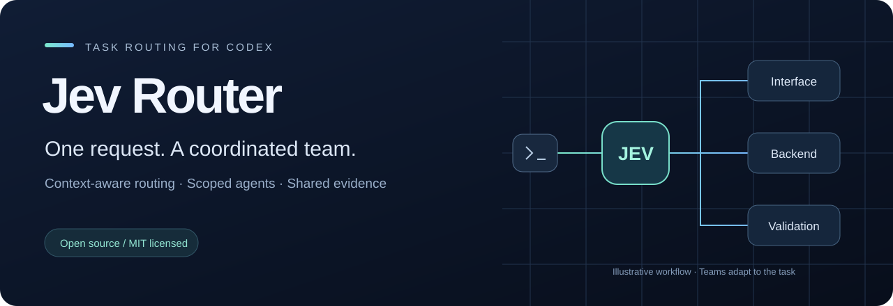
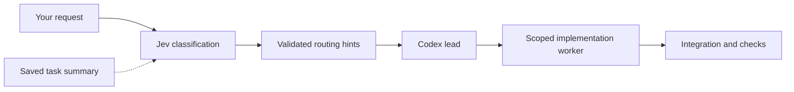

<div align="center">



**Context-aware task routing and coordinated subagents for local Codex.**

[](https://github.com/Madikhan33/jev_codex/actions/workflows/tests.yml)
[](pyproject.toml)
[](LICENSE)

[Install](#install-through-codex) · [How it works](#how-it-works) · [Update](#update) · [Documentation](#documentation) · [Русский](README.ru.md)

</div>

## Give each task the right scope

A color change, an API integration and a concurrency bug need different kinds of work.
Jev Router adds an editable routing layer to Codex: it identifies the task, recommends
an execution profile and gives the lead agent a workflow for assigning and checking work.

**Write a normal prompt. Codex remains the lead. Specialists get concrete assignments.**

| Capability | What it does |
| --- | --- |
| **Automatic routing** | A `UserPromptSubmit` hook classifies requests with Jev by TypeSafe. |
| **Context for follow-ups** | Task summaries maintained by the skill help interpret “fix this” without importing the entire conversation. |
| **Scoped delegation** | Every confirmed software change, including a small edit, goes to at least one scoped worker; the lead checks and integrates the result. |
| **Luna / Sol profiles** | Editable criteria prefer the smallest sufficient profile; Sol xhigh requires concrete escalation evidence in the planner. |
| **Research when needed** | The skill guides Codex to project files, public sources or a user clarification, depending on the missing fact. |
| **Peer coordination** | Workers exchange focused questions and findings using available host tools, with a lead-relay fallback. |

> **Early-stage community project.** Routing can be wrong; the lead checks recommendations.
> Model availability depends on your Codex environment. No measured cost or speed advantage
> is claimed. Independent of OpenAI and TypeSafe. [Validation and limitations →](docs/TESTING.md)

## Install through Codex

**Requirements:** Python 3.11+, internet access, a TypeSafe API key, and a local Codex
client supporting [hooks](https://learn.chatgpt.com/docs/hooks) and
[custom subagents](https://learn.chatgpt.com/docs/agent-configuration/subagents).
A ChatGPT subscription does not replace the TypeSafe key.

Paste this into Codex:

```text
Install https://github.com/Madikhan33/jev_codex for my local Codex and
set up automatic Jev Router use for future prompts. Clone it into a separate
directory, read the README and inspect the installer. Run install.py
--without-key with Python 3.11+, preserving my existing settings.
Check installation with run.py doctor. Show an absolute-path terminal
command for run.py configure; do not ask for my key in chat.
Explain restarting Codex and reviewing/trusting the UserPromptSubmit hook from
~/.codex/hooks.json in /hooks; its status reads jev-codex while running.
If setup is incomplete, state the remaining steps explicitly.
```

Then **enter your key in the terminal**, **restart Codex**, and **review and trust
`UserPromptSubmit` hook from `~/.codex/hooks.json` in `/hooks`**. The hook has
no separate list name; `jev-codex` appears as its status while it runs.
You can now submit your usual coding tasks.

<details>
<summary><strong>Prefer to install manually?</strong></summary>

Clone the repository, then run the installer from its directory:

```sh
git clone https://github.com/Madikhan33/jev_codex.git
cd jev_codex
```

```powershell
# Windows
py -3 install.py
py -3 run.py doctor
```

```sh
# macOS / Linux
python3 install.py
python3 run.py doctor
```

The installer creates a private Python environment, installs the SDK, registers the
skill, creates five agent profiles, merges the hook and prepends a removable Jev rule
to your global `~/.codex/AGENTS.md`. Existing instructions and settings are preserved.
Restart Codex and review `/hooks` after installation. The global rule asks Codex to
use the skill for software edits even when the hook produces no route.

The GitHub commands install published source. For an unpublished local checkout,
run the installer there. No PyPI release is required.

</details>

### Configure your key once

The installer requests your key through hidden terminal input. If you installed with
`--without-key`, run this from the source directory:

```powershell
py -3 run.py configure
```

Use `python3` on macOS/Linux. The saved key lives in
`~/.codex/jev-router/secrets.json` (`CODEX_HOME` can override `.codex`).
`TYPESAFE_API_KEY` from the Codex process environment takes precedence.

**The credential file is plaintext, not an encrypted keychain.** Never put a key in
chat, an issue or a commit. [Storage and privacy details →](SECURITY.md)

## How it works



Jev identifies work categories and recommends profiles. Python validates the output
and groups related work. The Codex lead uses the original request, project context
and skill instructions to assign confirmed software changes to scoped workers.
The skill also guides that assignment when hook metadata is missing, using a profile
chosen by the lead from available host capabilities. **The hook does not launch agents
or switch the parent model.** Research and messages run through the host's actual tools.

For example, a request to build a panel and its API may have an interface owner and a
server owner. They agree on the API contract, exchange necessary findings and return
checks for integration. A small color change goes to one Luna worker when that profile
is available. This is an illustration, not a fixed team or guaranteed classifier output.

| Profile family | Intended use | Effort presets |
| --- | --- | --- |
| **Luna** | Specified changes and bounded work following known patterns | xhigh, max |
| **Sol** | Local design choices, difficult constraints and evidenced expert escalation | medium, high, xhigh |

Profiles are configurable policy presets, not benchmark rankings. A vague prompt or
urgent wording is not evidence for escalation. [Team workflow →](docs/TEAMWORK.md)

## Update

Paste this into Codex whenever you want the latest published changes:

```text
Update my installed Jev Router from https://github.com/Madikhan33/jev_codex.
Find the source checkout, read the README and inspect the installer. Back up
local changes before fetching and integrating updates; do not discard them.
Run install.py --without-key with Python 3.11+, then run.py doctor.
Preserve my key, settings, other hooks and custom agent instructions.
Back up the installed classifier catalog and merge new prompt criteria while
preserving my customizations. Report conflicts and remaining steps.
Do not ask for my key in chat. Explain restarting Codex and checking /hooks.
```

**`git pull` alone is not an update to the installed runtime.** Rerun the installer
and restart Codex. Installed catalog files are preserved, so new classifier criteria
need a deliberate merge. There is no background auto-update.
[Manual updates, ZIP installations and conflicts →](docs/UPDATING.md)

## Inspect and customize

Run these from the source directory (`python3` on macOS/Linux):

```powershell
py -3 run.py doctor
py -3 run.py prompts --stage profiles --category backend_api
py -3 install.py --dry-run
```

The classifier prompts are plain TOML: [categories](jev_router/prompts/domains.toml),
[profiles](jev_router/prompts/profiles.toml), [shared rules](jev_router/prompts/routing.toml)
and [context](jev_router/prompts/context.toml). `doctor` and prompt previews are local;
`doctor` does not verify the key online, hook trust or account model access.

To remove the integration, run `py -3 install.py --uninstall`. It removes the hook,
unchanged managed skill/agent files, the unchanged global Jev rule and saved key,
while preserving unrelated or edited files and the private runtime.
[Full configuration reference →](docs/CONFIGURATION.md)

## Documentation

| Guide | Contents |
| --- | --- |
| [Configuration](docs/CONFIGURATION.md) | Settings, paths, diagnostics and troubleshooting |
| [Updating](docs/UPDATING.md) | Safe updates and preserving customizations |
| [Team workflow](docs/TEAMWORK.md) | Research, messages, ownership and economical profiles |
| [Architecture](docs/ARCHITECTURE.md) | Routing stages and runtime contracts |
| [Classifier catalog](docs/PROMPTS.md) | Generated view of the actual classification questions |
| [Testing](docs/TESTING.md) | Reproducible checks, live evaluations and known limits |
| [Security](SECURITY.md) | Data flow, key storage and reporting guidance |

## Contribute

Help improve category boundaries, add synthetic routing cases or report reproducible
installation issues. Start with [CONTRIBUTING.md](CONTRIBUTING.md).

```sh
python -m pip install ".[dev]"
python -m unittest discover -s tests -v
```

Found a bug? [Open an issue](https://github.com/Madikhan33/jev_codex/issues/new/choose)
with a sanitized reproduction. Please keep credentials, private prompts and session
logs out of public reports.

---

<div align="center">

**One request. Clear ownership. Checked results.**

[MIT licensed](LICENSE) · Built for the Codex community

</div>
